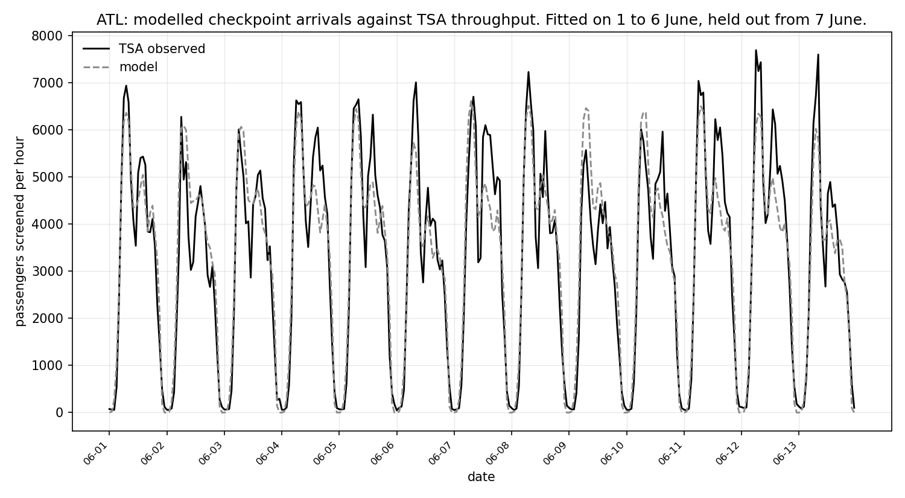
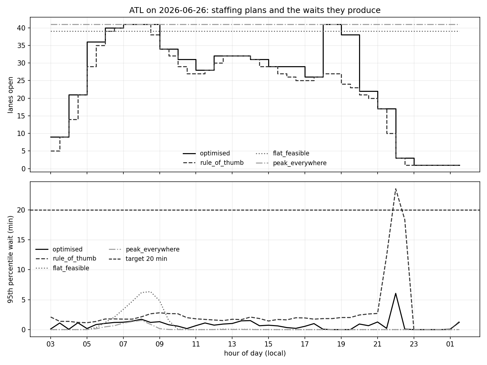
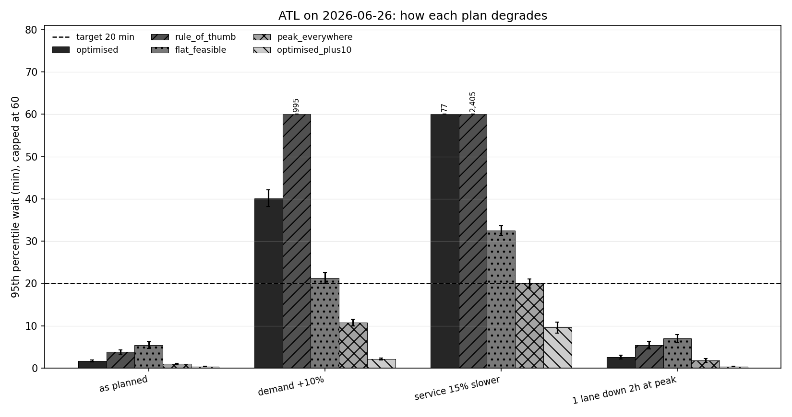

# Airport checkpoint simulation and staffing optimisation

I built a discrete event simulation of the security checkpoint at two US airports, driven
by the real flight schedule for June 2026, validated it against the throughput TSA
actually recorded at those checkpoints, and put a mixed integer optimiser on top of it
that chooses how many lanes to open in each half hour to hold the 95th percentile wait
under twenty minutes at the lowest staffing cost.

The airports are Hartsfield-Jackson Atlanta (ATL), the largest connecting hub in the
country, and Nashville (BNA), a mid-size origin and destination airport. I picked BNA
deliberately: TSA reports exactly one checkpoint there, called BNA Central, so the one
checkpoint per airport assumption in this model is not an assumption at BNA at all. It
very much is one at ATL, which has eight, and I say what that costs the answer.

Everything below comes from running the code. There is no recalled or estimated figure
anywhere in this file. `make demo` reproduces all of it.

## The four questions

1. How does checkpoint demand vary through the day given the actual schedule, and how
   sharp are the peaks against the daily mean?
2. Under a fixed staffing plan, what do waits look like by hour, and when does the queue
   break?
3. What is the cheapest plan, built from real shifts, that holds the 95th percentile wait
   under twenty minutes, and what does it save against the obvious alternatives?
4. How badly does that plan fail when demand runs ten percent hot, a lane goes down at
   the peak, or screening runs slower, and what does buying insurance cost?

## Data

| What | Source | State |
| --- | --- | --- |
| Flight schedule | BTS On-Time Reporting Carrier On-Time Performance, June 2026, `https://transtats.bts.gov/PREZIP/On_Time_Reporting_Carrier_On_Time_Performance_1987_present_2026_6.zip` | Downloaded. Origin, scheduled local departure time, operating carrier, cancellation flag. |
| Checkpoint throughput | TSA FOIA reading room weekly PDFs, `https://www.tsa.gov/sites/default/files/foia-readingroom/tsa-throughput-data-may-31-2026-to-june-6-2026.pdf` and the week of 7 to 13 June | Downloaded and parsed. Passengers screened per airport, per checkpoint, per clock hour. |
| Seats per departure | BTS T-100 Domestic Segment | Not obtained. No stable direct URL, and the ASP.NET form behind it does not survive being driven programmatically. Seats are an assumption by operating carrier, labelled as one. |
| Show-up profile | Airport terminal planning literature (ACRP Report 25, IATA ADRM) | Functional form taken from the literature. Parameters assumed, then one timing shift fitted on the calibration week. |
| Service times | TSA and airport planning figures | Assumed point values chosen so one open lane clears about 160 passengers an hour, inside the published range for a standard lane. Varied in the sensitivity analysis. |

The BTS origin throttles a single connection to roughly 13 KB a second, which would take
close to an hour for a 32 MB file. `scripts/fetch_data.py` pulls it in parallel byte
ranges instead, which brings it down to a few minutes. The TSA reading room refuses
plain HTTP clients with a 403 no matter what headers it is given; the fetch script says
so and prints the exact URLs to retrieve by hand rather than failing quietly.

Raw files stay out of version control. One airport-day of schedule and the matching TSA
hours are committed under `data/sample`, so `make test` runs with no network call.

## How the model works

**Demand.** Scheduled departures times seats times load factor gives passengers on
board. A screening yield turns that into people who actually clear the checkpoint. Each
flight's passengers are then pushed backwards in time through a show-up profile onto
five minute slots.

**The checkpoint.** A SimPy model with two stages. Passengers queue for a travel document
check, then queue for a screening lane. Service times are lognormal, not constant. A
share of passengers is pulled for a secondary bag search that occupies the lane for a
second draw. Lanes open and close on the half hour according to the staffing plan and
always finish the passenger in front of them. Every passenger is an entity carrying its
arrival time, its flight, its wait at each stage, and whether it cleared screening far
enough ahead of its departure to make the flight.

**The optimiser.** Two layers. A queueing approximation converts each half hour's arrival
rate into a lane requirement. A set covering mixed integer program then buys shifts, in
whole blocks with a limited set of start times, to cover that requirement at least cost,
solved with HiGHS through `scipy.optimize.milp`. The resulting plan goes back through the
simulation. Where the simulation says a half hour misses the target, that half hour's
requirement goes up by one lane and the program is re-solved. The number of rounds and
the gap between what the approximation promised and what the simulation delivered are
both reported.

## Assumptions

Every assumption lives in `config/config.yaml` and reaches the rest of the code
through one module. This table is generated from that file, so it cannot drift from
what the model actually used. The word assumed means exactly that: a number I chose,
not one I measured.

| setting | value | source |
| --- | --- | --- |
| demand.load_factor | 0.855 | Assumed. Sits inside the range US domestic carriers report for a summer month. Varied in the sensitivity analysis. |
| demand.showup.family | beta | Functional form follows the unimodal show-up profiles used in airport terminal planning: ACRP Report 25, Airport Passenger Terminal Planning and Design (Transportation Research Board, 2010) and the IATA Airport Development Reference Manual. The parameters below are assumed, not measured. |
| demand.showup.earliest_minutes_before_departure | 20 | Assumed. |
| demand.showup.latest_minutes_before_departure | 210 | Assumed. |
| demand.showup.alpha | 2.35 | Assumed. Shifted plus and minus 15 minutes in the sensitivity analysis. |
| demand.showup.beta | 3.1 | Assumed. Shifted plus and minus 15 minutes in the sensitivity analysis. |
| demand.slot_minutes | 5 | Modelling choice, not an assumption about the world. |
| days.calibration_start | 2026-06-01 | Calibration window. The screening yield and the show-up shift are fitted here and nowhere else. |
| days.calibration_end | 2026-06-06 | Calibration window. |
| days.anchor_week_start | 2026-06-07 | Held out week. Every validation figure quoted comes from this window, which the fit never saw. |
| days.anchor_week_end | 2026-06-13 | Held out week. |
| service.doc_check.mean_seconds | 12.0 | Assumed. A travel document check of about twelve seconds gives one podium roughly 300 passengers an hour, which is the order of magnitude quoted for the position. |
| service.doc_check.positions_per_lane | 0.7 | Assumed. Set so document check is not the binding stage, which matches how checkpoints are actually staffed. |
| service.doc_check.cv | 0.35 | Assumed. |
| service.screening.mean_seconds | 14.5 | Assumed. Chosen together with the secondary screening figures so that one open lane clears about 160 passengers an hour, inside the 150 to 180 per hour range quoted for a standard screening lane. Varied in the sensitivity analysis. |
| service.screening.cv | 0.45 | Assumed. |
| service.secondary.share | 0.055 | Assumed. Represents a bag search that occupies the lane, not a pat-down handled to one side. |
| service.secondary.mean_seconds | 145.0 | Assumed. |
| service.secondary.cv | 0.6 | Assumed. |
| staffing.cost_per_lane_hour | 160.0 | Assumed. Roughly four and a half screening officers on a lane at a fully loaded hourly cost. Only relative cost between plans matters for the recommendation. |
| staffing.min_shift_slots | 8 | Assumed shift rule, a four hour minimum block. |
| staffing.shift_start_stride_slots | 2 | Assumed shift rule, shifts may start on the hour. |
| staffing.max_lanes | 70 | Assumed physical cap on the pooled checkpoint. |
| target.p95_wait_minutes | 20.0 | Policy target, set by the study rather than observed. |
| optimiser.safety_margin | 0.0 | Modelling choice. A global inflation of the arrival rate before the queueing approximation sizes a slot. Zero, because the simulation feedback loop tightens locally instead, which is cheaper than padding every slot. |
| optimiser.max_rounds | 6 | Modelling choice. The cap on how many times the requirement is tightened and the MILP re-solved. |
| target.clearance_cutoff_minutes | 30.0 | Assumed. A passenger is counted as having made their flight if they clear screening at least this long before scheduled departure. |
| airports.large_hub.connecting_share | 0.6 | Prior assumption only. The figure actually used is the originating factor fitted to TSA throughput on the calibration week, reported in validation_calibration.csv. |
| airports.mid_size.connecting_share | 0.1 | Prior assumption only. Superseded by the fitted originating factor in the same way. |
| seats_per_departure | 23 carriers, 30 to 195 seats, default 110 | Assumed, by operating carrier. BTS T-100 Domestic Segment is the right source for seats but has no stable direct download and its form could not be driven from this environment, so these are stated fleet averages rather than measurements. |

## Verification: does the engine compute a queue correctly

Two checks, both reported rather than only asserted in the test suite.

**Against an independent implementation.** I wrote a second, unrelated simulator: a
Lindley recursion over a heap of server free times, sharing no code with the SimPy model.
Given the same 8,666 arrivals and the same service draws, the two produce waiting times
that differ by **0.0 minutes at the largest**. That is exact agreement, not agreement to
a tolerance.

That check earned its place. An earlier version of the engine had SimPy servers waiting
on `Store.get() | timeout` and cancelling the get when the timeout won. If an item was
matched to that get at the same simulation instant, the cancel arrived too late, the get
had already been handed a passenger, and nobody read it. Every fifth passenger vanished.
The deterministic queue test caught it and the engine now uses an explicit dispatcher.

**Against Erlang C**, in the one regime where a closed form exists: Poisson arrivals,
exponential service, a fixed server count, one stage.

| lanes | arrivals/hr | utilisation | simulated mean wait (min) | analytic (min) | error | within MC interval |
| --- | --- | --- | --- | --- | --- | --- |
| 4 | 120 | 0.750 | 0.739 ± 0.042 | 0.764 | -3.3% | yes |
| 6 | 180 | 0.750 | 0.405 ± 0.024 | 0.422 | -4.0% | yes |
| 10 | 300 | 0.750 | 0.188 ± 0.015 | 0.184 | +2.2% | yes |
| 14 | 460 | 0.821 | 0.228 ± 0.017 | 0.231 | -1.3% | yes |

The ± figures are 95 percent Monte Carlo half widths. I spent an hour convinced the
engine was biased low before working out that a single simulated day of a checkpoint this
size carries a standard deviation on the mean wait of around twenty percent, so six
replications could not possibly resolve a five percent difference. The test now states
its interval rather than asserting a tolerance and hoping.

## Validation: does the demand look like what turned up

Three parameters per airport are fitted on 1 to 6 June and on nothing else: the intercept
and slope of the screening yield, and one show-up timing shift. Everything below is
scored on 7 to 13 June, which the fit never saw.

| | ATL | BNA |
| --- | --- | --- |
| Show-up shift fitted | +20 min earlier | -5 min |
| Screening yield at 06:00 departures | 0.884 | 0.993 |
| Screening yield at 12:00 departures | 0.761 | 0.800 |
| Screening yield at 20:00 departures | 0.599 | 0.543 |
| Held-out hourly correlation | 0.950 | 0.914 |
| Held-out busy-hour MAPE | 21.5% | 27.3% |
| Held-out daily MAPE | 7.2% | 9.8% |
| Held-out level ratio | 0.979 | 0.910 |
| Held-out morning ratio (05:00 to 09:00) | 0.994 | 0.959 |
| Held-out evening ratio (17:00 to 21:00) | 1.017 | 1.127 |

The screening yield is deliberately not called a connecting share. It is checkpoint
passengers per scheduled domestic seat, and it absorbs four things at once that nothing
here can separate: passengers who connect airside, international departures the domestic
file does not contain, crew whom the TSA count includes, and any error in my assumed
seats and load factor.

**Why it varies with departure hour.** With one constant yield the model under-predicted
the ATL morning peak by 16 percent and over-predicted the evening by 28. That is not
noise, it is structure: a hub's morning banks are mostly people starting a trip and its
evening banks are mostly people changing planes. Letting the yield fall linearly with
departure hour costs one extra parameter and fixes it. On the held-out week the morning
ratio moves from 0.838 to 0.994 and the evening from 1.283 to 1.017. That matters more
than any summary statistic, because the morning peak is the thing the entire staffing
question turns on.

| held out week, ATL | flat yield | yield varying with departure hour |
| --- | --- | --- |
| hourly correlation | 0.913 | 0.950 |
| morning ratio | 0.838 | 0.994 |
| evening ratio | 1.283 | 1.017 |

What still misses: BNA in the early afternoon, where the model runs low. A straight line
in departure hour is the simplest thing that fixes the morning and the evening, and I
would rather leave a visible residual than add parameters until it disappears.



## Question 1: how sharp are the peaks

Across the nine days modelled at each airport:

| | ATL | BNA |
| --- | --- | --- |
| Checkpoint passengers per day | 67,745 to 82,126 | 26,989 to 33,427 |
| Busiest hour | 5,793 to 6,608 | 2,443 to 2,844 |
| Mean hour | 2,945 to 3,571 | 1,173 to 1,453 |
| Peak to mean, hourly | 1.8 to 2.0 | 1.8 to 2.2 |
| Busiest five minute slot, as a rate | 5,861 to 6,725 per hour | 2,591 to 2,988 per hour |
| When the peak lands | 07:00 | 05:00 to 06:00 |

Both airports run at roughly twice their daily mean in the busiest hour, and BNA's peak
is both earlier and sharper relative to its own mean. Nothing about a daily total tells
you how to staff either of them.

## Question 2: what a fixed plan does

The obvious wrong answer is to divide the day's passengers by what a lane can clear and
open that many lanes all day. At ATL that is 23 lanes.

| | ATL, 23 lanes flat | BNA, 10 lanes flat |
| --- | --- | --- |
| 95th percentile wait | 290.1 ± 3.3 min | 220.4 ± 4.4 min |
| Mean wait | 180.8 min | 146.1 min |
| Maximum wait | 292.8 min | 224.2 min |
| Share missing their flight because of the queue | 75.9% | 75.5% |

The by-hour table shows exactly when it breaks. At ATL the queue is fine until 04:00, is
already at a 22 minute 95th percentile by 05:00, 64 minutes by 06:00, and never recovers
for the rest of the operating day. A plan sized to the average does not fail at the peak
and then catch up. It fails at the peak and stays failed, because there is no hour left
in the day with enough spare capacity to drain what the morning built.

## Question 3: the cheapest plan that holds the target

The optimiser met the 20 minute target on the first round on all 18 airport-days, with
zero half hours over target. That is a result rather than a formality, and the reason is
worth stating: the queueing approximation is **conservative** here, not optimistic.

| promised against delivered, per half hour | ATL | BNA |
| --- | --- | --- |
| Mean 95th percentile promised by the approximation | 3.27 min | 3.32 min |
| Mean 95th percentile the simulation delivered | 0.94 min | 1.10 min |
| Mean gap | -2.33 min | -2.22 min |
| Worst half hour promised | 19.6 min | 19.8 min |
| Worst half hour delivered | 7.5 min | 3.6 min |

The approximation assumes exponential service. Screening is not that variable, so real
waits come in below what Erlang C predicts, and that outweighs the fact that the
approximation also treats each half hour as stationary when it is not. This is a fact
about this regime and not a general property. A sharper ramp or a tighter target would
flip the sign, which is exactly why the feedback loop exists.

### Comparing plans

Mean over all nine days at each airport. Every plan meets the target on the nominal day;
they differ on cost and on what happens when the day does not go to plan.

| airport | plan | cost per day | 95th pct wait | max wait | days meeting target |
| --- | --- | --- | --- | --- | --- |
| ATL | optimised | $88,391 | 1.92 min | 6.4 min | 9 of 9 |
| ATL | rule of thumb | $79,680 | 4.26 min | 35.0 min | 9 of 9 |
| ATL | cheapest feasible flat | $142,293 | 3.24 min | 4.4 min | 9 of 9 |
| ATL | peak lanes all day | $149,653 | 0.69 min | 1.6 min | 9 of 9 |
| BNA | optimised | $37,973 | 2.37 min | 5.0 min | 9 of 9 |
| BNA | rule of thumb | $33,244 | 4.72 min | 9.0 min | 9 of 9 |
| BNA | cheapest feasible flat | $57,244 | 7.00 min | 8.9 min | 9 of 9 |
| BNA | peak lanes all day | $64,604 | 0.79 min | 2.1 min | 9 of 9 |

Against the flat plan the optimiser saves 38 percent at ATL and 34 percent at BNA. Against
staffing the peak all day it saves 41 percent at both.

The rule of thumb looks cheaper than the optimised plan, by ten percent at ATL. It is
not a fair comparison and I would not present it as one: the rule of thumb sets lanes
freely in every half hour, which no roster can do. It is what the optimiser would cost if
staff could be summoned and dismissed on the half hour. Its maximum wait also averages 35
minutes at ATL against 6.4 for the optimised plan, and it is the plan that fails worst
under stress.



### What the roster rules cost, separately from the service target

A plan that could set lanes freely each half hour would buy 528.5 lane-hours at ATL on
the design day. Real shifts cannot, and the difference is the price of the roster.

| ATL, shift length | starts every 30 min | starts hourly | starts every 2h |
| --- | --- | --- | --- |
| 2 hours | +0.7% | +5.2% | +13.2% |
| 4 hours | +4.5% | +10.5% | +14.3% |
| 6 hours | +13.5% | +13.5% | +14.7% |
| 8 hours | +18.1% | +28.7% | +34.7% |

In money, ATL runs from $85,120 a day on two hour shifts starting every half hour to
$113,920 on eight hour shifts starting every two hours. That $28,800 spread is a 34
percent premium on the cheapest structure, and it is decided by the rostering rules
rather than by anything to do with queueing. BNA shows the same pattern over a range of 3.6 to 29.7 percent. Where the target
is comfortably met, this is where the money actually is.

### What the wait target costs

Almost nothing, which is worth knowing.

| target | ATL peak lanes | ATL cost | BNA peak lanes | BNA cost |
| --- | --- | --- | --- | --- |
| 30 min | 41 | $93,440 | 19 | $40,320 |
| 20 min | 41 | $93,440 | 19 | $40,320 |
| 10 min | 41 | $93,440 | 19 | $40,960 |
| 5 min | 41 | $93,440 | 19 | $40,960 |
| 3 min | 42 | $94,080 | 19 | $40,960 |

At these volumes, rounding raw capacity up to a whole lane already leaves enough slack for
a generous percentile target. Tightening from thirty minutes to five buys nothing at ATL;
only at three minutes does it buy a single extra lane, for 0.7 percent more. The binding
constraint is throughput, not queueing. Anyone reading this as a queueing optimisation has
the emphasis wrong: it is a capacity covering problem with a queueing sanity check on top.

### What pooling the halls into one queue is worth

This is the model's largest simplification, so I measured it rather than excusing it. ATL
has eight checkpoints; six of them screen departing passengers. I split the day's demand
across those six in the proportions TSA recorded and gave each its own queue.

| ATL layout | lane-hours | cost | worst checkpoint 95th pct | meets target |
| --- | --- | --- | --- | --- |
| Pooled into one queue | 584 | $93,440 | 1.7 min | yes |
| Split, same lanes shared out | 602 | $96,320 | 36.2 min | **no** |
| Split, each hall optimised | 668 | $106,880 | 5.4 min | yes |

Taking the pooled plan and simply distributing its lanes across the six halls in
proportion to demand misses the target badly: the worst hall reaches a 36 minute 95th
percentile. Buying the target back costs **14.4 percent more** than the pooled figure.
So the ATL lane counts in this report are a floor, not a plan, and the honest ATL number
is a shade over $106,000 a day rather than $93,440. At BNA there is nothing to split, and
its numbers stand as they are.

## Question 4: robustness, and the price of insurance

Design day, each plan run through three stresses.

| ATL scenario | optimised | rule of thumb | flat | peak all day | optimised for +10% |
| --- | --- | --- | --- | --- | --- |
| As planned | 1.7 min | 3.8 | 5.4 | 1.0 | 0.4 |
| Demand +10% | **40.1 min** | **995** | **21.3** | 10.7 | 2.1 |
| Service 15% slower | **77.1 min** | **2,405** | **32.5** | 20.0 | 9.6 |
| One lane down 2h at peak | 2.6 min | 5.4 | 7.0 | 1.8 | 0.4 |

Bold means the target is missed. One entry deserves a caveat: peak staffing under the
service slowdown lands at 19.98 minutes against a 20 minute target, with a Monte Carlo
half width of 1.06, so it is not distinguishable from a plan that misses. I would call
that a coin toss rather than a pass.

Three things come out of this.

**A lane outage at the peak is a non-event.** Every plan absorbs it. This surprised me and
it is the sort of thing an operation might otherwise spend money guarding against.

**Demand and service errors are not survivable.** A plan sized tightly to capacity does
not degrade gently when demand exceeds it. It has a cliff. Ten percent more passengers
takes the optimised ATL plan from a 1.7 minute wait to 40 minutes and puts 15 percent of
passengers behind their flight because of the queue. Fifteen percent slower screening
takes it to 77 minutes and 34 percent. The rule of thumb, which carries no margin at all,
reaches 995 and 2,405 minutes, which is another way of saying the checkpoint stops
working entirely.

**Insurance is cheap relative to the failure.** A plan optimised against demand ten
percent above the schedule costs $102,400 at ATL against $93,440, an extra **$8,960 a
day, 9.6 percent**. It holds the target in every stress tested, including the fifteen
percent service slowdown that was not the case it was built for. At BNA the same
insurance costs $3,200 a day, 7.9 percent.



## Sensitivity

Cost of the optimised plan on the design day as each assumption moves.

| assumption | ATL cost range | swing |
| --- | --- | --- |
| Screening mean 12.5 to 17.0 s | $84,480 to $103,040 | -9.6% to +10.3% |
| Screening yield ±0.10 | $80,640 to $106,880 | -13.7% to +14.4% |
| Load factor 0.80 to 0.90 | $87,040 to $97,920 | -6.9% to +4.8% |
| Show-up shift ±15 min from fitted | $92,160 to $92,800 | -1.4% to -0.7% |

The show-up curve, which is the assumption I had least evidence for, turns out to matter
least: shifting it a quarter of an hour in either direction moves cost by about one
percent, and in both directions slightly downwards, which is lumpiness in the shift
covering rather than a signal. The airport is busy for long enough that sliding the
arrival curve sideways barely changes the peak. The screening rate and the screening
yield are what the answer actually rests on, and both are worth more measurement than I
was able to give them.

## Monte Carlo error

Thirty replications per scenario. Reading the same replications back at smaller counts
shows what that buys:

| replications | ATL 95th pct estimate | half width | BNA estimate | half width |
| --- | --- | --- | --- | --- |
| 5 | 1.30 min | ±0.26 | 3.29 min | ±1.21 |
| 10 | 1.60 | ±0.35 | 2.84 | ±0.68 |
| 20 | 1.62 | ±0.24 | 2.53 | ±0.42 |
| 30 | 1.71 | ±0.23 | 2.42 | ±0.31 |

Every simulated percentile in this report carries its half width. Against a twenty minute
target these intervals are small in the only sense that matters: a quarter of a minute,
not a quarter of the target. They are not small as a share of the estimates themselves,
because the estimates are around two minutes, and I would not quote a difference between
two plans of less than half a minute as meaningful.

## Reproducibility

The whole study was run three times: twice back to back, and once more through
`make demo` after `make clean` had removed every intermediate and output file. All three
sets of result tables are byte for byte identical. Every random stream derives from one seed in
`config/config.yaml` through a stable hash, which is deliberate: an earlier version keyed
the streams off Python's built in `hash` of a tuple of strings, which is salted per
process, so two runs disagreed while every test inside a single process passed. There is
now a test pinning the stream identifiers so that cannot come back quietly.


## What the model does not cover

- No check-in and no bag drop. Demand arrives directly at the checkpoint.
- No boarding, no gates, no arrivals process. This is a departures checkpoint model.
- One pooled checkpoint per airport. At BNA that is exactly what TSA reports. At ATL it
  pools eight real checkpoints into a single queue, which flatters the answer, because
  pooled servers are more efficient than the same servers split across queues that
  cannot help each other.
- No PreCheck or CLEAR lane classes. One blended lane type, calibrated so its effective
  throughput matches published standard lane figures.
- No staff breaks, meal reliefs or training beyond what the shift rules encode.
- No weather, no equipment failure beyond the single lane outage tested in the
  robustness section, no queue abandonment, and no passengers who give up and rebook.
- Cancelled flights are dropped from demand. Their passengers rebook and travel later,
  so this understates demand slightly on days with many cancellations.

## Reproducing this

```
pip install -r requirements.txt
make demo
```

`make demo` fetches the raw data, parses the TSA PDFs, runs the test suite, runs the
whole study, and writes the formatted result blocks. Individual stages are `make fetch`,
`make tsa`, `make test`, `make run` and `make report`. `make quick` is a smoke test with
few replications and two days per airport; its numbers are not results.

The seed is reported in `outputs/tables/results.json` along with the replication counts
and the runtime. A full run takes about forty minutes on eight otherwise idle cores. The
runtime recorded in `results.json` will be considerably longer if the machine is busy,
since the replications are what dominate.

## What this demonstrates, and where it would be pushed back on

What it demonstrates: a demand model built from a real schedule rather than an invented
Poisson rate, calibrated on one week and scored on the next; a discrete event model whose
queue logic is checked twice, once against an independent implementation to the last bit
and once against Erlang C with the Monte Carlo interval stated; an optimiser that is
honest about the fact that its constraint is an approximation and that checks itself in
the simulation; and a set of results that includes the ones that are inconvenient.

Where I would expect to be pushed:

**The show-up curve.** The shape comes from the planning literature; the parameters do
not. I fit exactly one number about it, a timing shift, and the sensitivity shows what a
quarter of an hour of error in it costs. What I have not modelled is that the curve is
not one curve. Passengers on the first departure of the day arrive relatively later,
long-haul passengers arrive earlier, and anyone checking a bag arrives earlier still.
That heterogeneity would widen the arrival distribution and flatten the peak slightly,
which would make my lane requirement a touch conservative at the peak.

**The screening yield.** This is the assumption I would defend hardest and claim least
for. It is a yield, not a connecting share, and it absorbs connecting passengers, the
international departures the domestic file does not contain, crew, and any error in my
seats and load factor at the same time. Nothing available separates them. Anyone who
reads the fitted ATL number as a statement about how many people connect at ATL has
misread it, which is why the code, the tables and this file all call it a yield.

**One checkpoint per airport.** At BNA this is exactly what TSA reports. At ATL it is a
real simplification and I have measured rather than excused it: the split experiment
gives each hall its own queue in the proportions TSA recorded and reports what that costs.
Pooling always flatters, because a free lane in one hall cannot serve a queue in another.

**The queueing approximation inside the optimiser.** It assumes exponential service and
a constant rate inside each half hour. Neither is true. The direction of the error turns
out to be conservative rather than optimistic, because exponential service is more
variable than screening actually is, and that outweighs the within-slot ramp at these
volumes. That is a fact about this regime, not a general property, and a sharper morning
ramp or a tighter target would flip it. The feedback loop exists precisely so that the
answer does not depend on my being right about which way it goes.

**The absolute wait numbers are optimistic.** This model staffs a pooled checkpoint
optimally against a schedule known in advance. No real airport does that, and the waits
here are correspondingly lower than the ones passengers experience. The comparisons
between plans are the durable output; the levels are not.

**Cost.** A pound figure per lane-hour is an assumption, and only the ratios between
plans survive it. Nothing in the recommendation depends on the level.

**Days are independent.** Each day is planned on its own. There is no roster continuity
across days, no weekly hours limit, no overtime rules and no rest requirements, all of
which a real workforce planner would apply and all of which would raise the cost of the
peaked plans relative to the flat ones.
